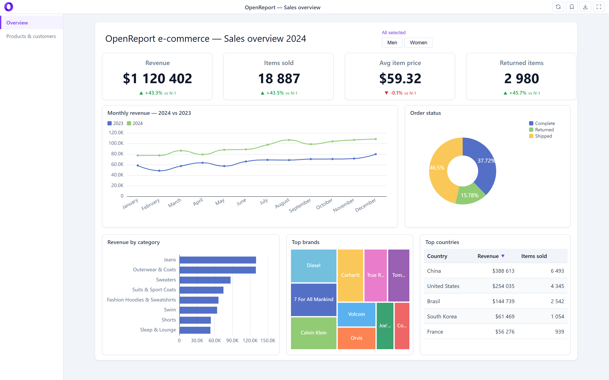
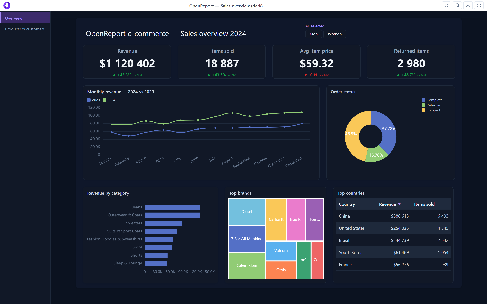
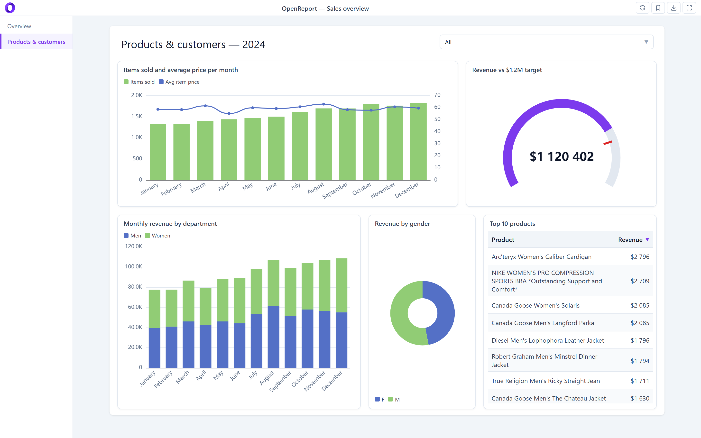
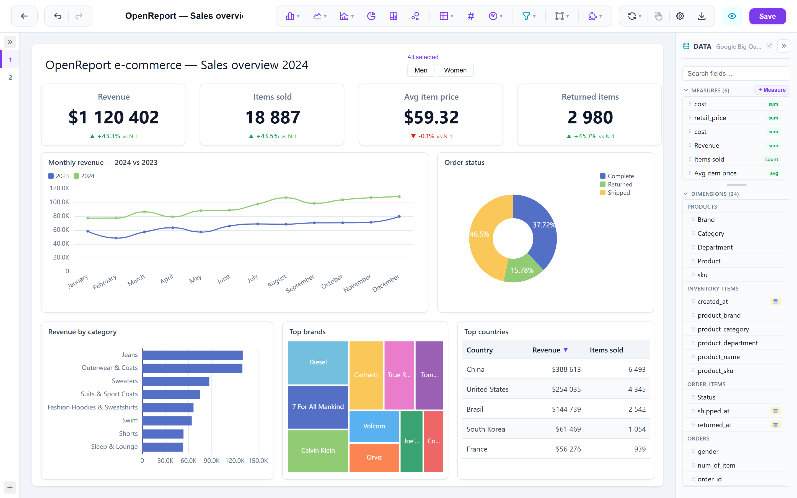
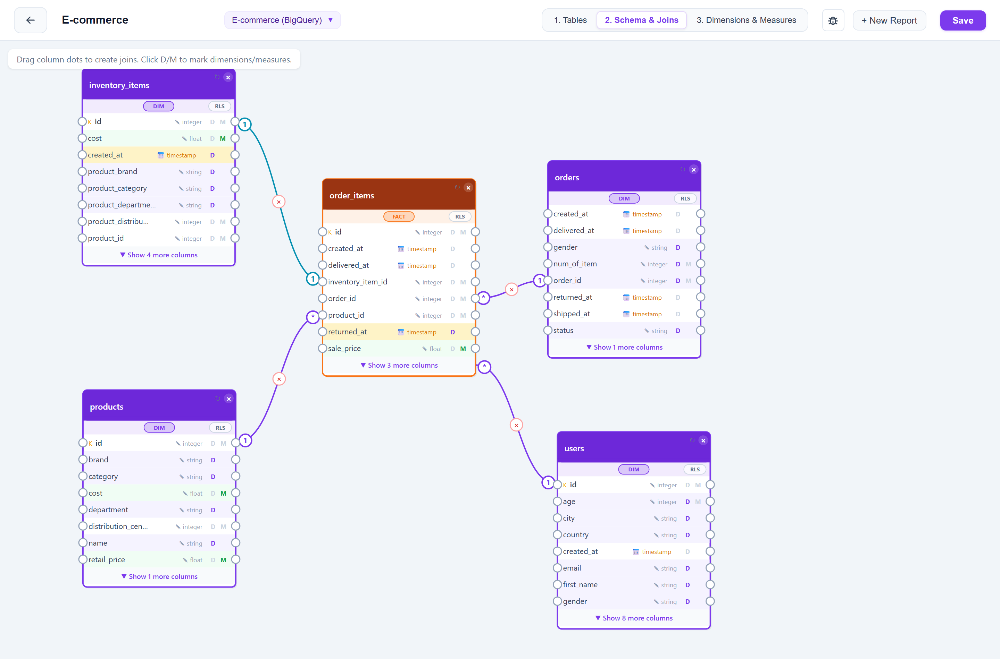

# Open Report

[](LICENSE)

> Free and open source under [AGPL-3.0](LICENSE). Self-host it, fork it, use it at work.

Superset too complicated? Metabase too limited? Power BI not open source? That's why I built Open Report.

An open source, self-hosted reporting and data visualization platform, easy to run and easy to configure. Point it at your database, describe your tables once (joins, dimensions, measures), then build interactive dashboards on a drag-and-drop canvas. It compiles the SQL for you, in your dialect, against your data. Nothing leaves your infrastructure.

**Think Power BI / Looker Studio, but open source and self-hosted.**

## Screenshots

A sales dashboard built on the public `thelook_ecommerce` BigQuery dataset: scorecards with year-over-year comparison, a slicer, line, donut, bar, treemap and table visuals.



Every report has its own theme. The same dashboard in dark mode:



Reports can have several pages. Page two mixes a combo chart with a secondary axis, a gauge with a target, a stacked bar and a top-N table:



The editor: drag fields from the semantic model onto the canvas, then tune each visual in the property panel. Undo/redo, snap-to-grid, cross-filtering.



The semantic model: pick tables, draw joins with their cardinality, flag dimensions and measures once and every report reuses them. The fact table is highlighted, and the model is where Row-Level Security is defined.



## Features

- 10+ visualization types, and you can write your own
- Drag-and-drop canvas with snap-to-grid, shapes and free positioning
- Semantic model: joins, dimensions, measures, calculated fields, date intelligence
- Row-Level Security
- Scheduled refresh and a pre-aggregation cache
- Cross-filtering and cross-highlighting between visuals
- Workspace and user management, public share links
- Export to PDF, PNG, Excel
- Connects to PostgreSQL, Amazon Redshift, Snowflake, Databricks, ClickHouse, MySQL, Oracle, SQL Server, Azure SQL, BigQuery, DuckDB
- Imports CSV, Excel (.xlsx), Parquet, JSON, TSV
- [REST API](API.md) for scripted refreshes, with scoped tokens

## What it doesn't do (yet)

- One fact table per widget. Combining two fact tables in a single query inflates the numbers through join fan-out, so it is deliberately not offered.
- The pre-aggregation cache doesn't cover every measure. Non-additive ones and exotic SQL functions fall back to a live query against the source.
- Report building is a desktop workflow. Viewing on mobile works; editing on mobile is not something I have designed for.
- Pivot tables are computed client-side, so very large result sets will hurt.
- No schema migration tool. Upgrades run idempotent ALTERs at boot.

## Tech Stack

| Layer | Technology |
|---|---|
| Frontend | React 19 + Vite |
| Charts | ECharts |
| Icons | Tabler Icons (react-icons) |
| Backend | Node.js + Express |
| Metadata DB | SQLite (better-sqlite3) |
| Auth | Passport.js (local strategy) |
| File Import | DuckDB |

## Quick Start

### Docker

One container, plain HTTP on port 3001. Works on a home server, a NAS or a
Raspberry Pi; the image is built for amd64 and arm64.

```bash
mkdir openreport && cd openreport
curl -fsSL https://raw.githubusercontent.com/cracky777/openreport/master/docker-compose.simple.yml -o docker-compose.yml
printf 'SESSION_SECRET=%s\nINTERNAL_TOKEN_SECRET=%s\nDATASOURCE_ENC_KEY=%s\n' \
  $(openssl rand -hex 32) $(openssl rand -hex 32) $(openssl rand -hex 32) > .env
docker compose up -d
```

Open http://localhost:3001 and sign up: the first account becomes the admin.
Everything lives in the `openreport-data` volume (SQLite metadata, uploads,
caches); the three secrets in `.env` are mandatory, and `DATASOURCE_ENC_KEY`
encrypts your database passwords, so back it up with the volume. Upgrade with
`docker compose pull && docker compose up -d`.

- **Behind your own reverse proxy** (Caddy, Traefik, Nginx Proxy Manager):
  point it at port 3001 and forward `X-Forwarded-Proto`. The session cookie
  gets its `Secure` flag from that header, so plain HTTP on the LAN and HTTPS
  through the proxy both work with the same image.
- **Public host with TLS built in**: the [`docker-compose.yml`](docker-compose.yml)
  at the root of the repository bundles nginx and a Let's Encrypt certificate.
  Clone the repository, fill in `.env` and follow the comments in the file.
- **Without Docker** — a Node 22 host, systemd, or hacking on the code — see below.

### From source

Prerequisites: Node.js >= 22 (an older one is refused with an `EBADENGINE` error,
because DuckDB cannot be built on it) and npm >= 9.

```bash
git clone https://github.com/cracky777/openreport.git open-report
cd open-report
./install.sh
npm run dev
```

`install.sh` settles the Node version first — it installs Node 22 through nvm,
under your own home directory and without sudo, when the one on your PATH is
missing or too old — then installs every dependency. Set `OPENREPORT_SKIP_NODE=1`
to manage Node yourself. On Windows, or to do it by hand: install Node 22, then
`npm run install:all`.

`npm run dev` serves the frontend on http://localhost:5173 and the API on
http://localhost:3001. For a production process without Docker, build the
client with `npm run build` and run `npm start`: the server then serves the
built frontend itself on port 3001, with the same environment variables as the
Docker image (see [`.env.example`](.env.example)).

### First admin

There is no pre-seeded admin account. The **first user to sign up becomes the admin** — visit `/login`, click *Sign up*, and the account you create will be promoted automatically.

## Project Structure

```
open-report/
├── client/                 # React frontend (Vite)
│   ├── src/
│   │   ├── components/
│   │   │   ├── Canvas/     # Report canvas with drag & drop
│   │   │   ├── DataPanel/  # Data binding panel
│   │   │   ├── DropZone/   # Field wells with reordering
│   │   │   ├── PropertyPanel/ # Widget configuration
│   │   │   ├── SettingsPanel/ # Report settings
│   │   │   ├── Toolbar/    # Top toolbar
│   │   │   └── Widgets/    # All widget components
│   │   ├── pages/          # Editor, Dashboard, Viewer, Admin
│   │   ├── hooks/          # useHistory (undo/redo)
│   │   └── utils/          # formatNumber, dateHelpers, etc.
├── server/                 # Express API
│   ├── routes/             # REST endpoints
│   ├── db/                 # SQLite schema & connection
│   ├── utils/              # Database connectors
│   └── middleware/         # Auth middleware
├── docs/                   # Architecture, authorization, screenshots
├── API.md                  # Public API (v1) reference
├── LICENSE                 # GNU AGPL-3.0
├── CONTRIBUTING.md
└── README.md
```

## Contributing

Contributions are welcome.

- **[ARCHITECTURE.md](ARCHITECTURE.md)** — how a widget becomes SQL, and which file
  to open for which change. Read this first; it saves more time than it takes.
- **[CONTRIBUTING.md](CONTRIBUTING.md)** — setup, tests, and what a good pull request looks like.
- **[SECURITY.md](SECURITY.md)** — how to report a vulnerability. Please do not open an issue for one.
- **[CODE_OF_CONDUCT.md](CODE_OF_CONDUCT.md)**

Questions and ideas go to [Discussions](https://github.com/cracky777/openreport/discussions);
confirmed bugs go to [Issues](https://github.com/cracky777/openreport/issues/new/choose).


## License

[GNU Affero General Public License v3.0](LICENSE).

Free to use, self-host, modify and redistribute. If you run a modified version
as a network service, the AGPL requires you to publish your changes under the
same license.

Contributions are accepted under the same license (see
[CONTRIBUTING.md](CONTRIBUTING.md)).
