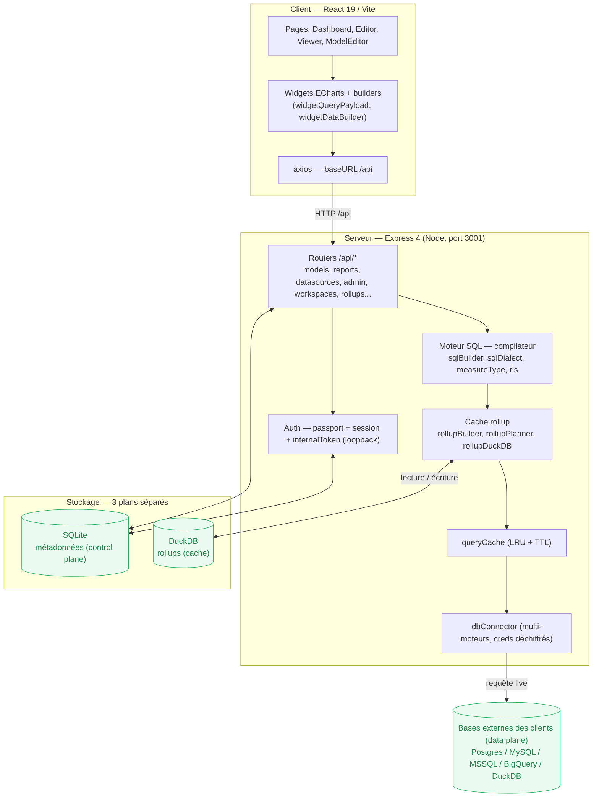
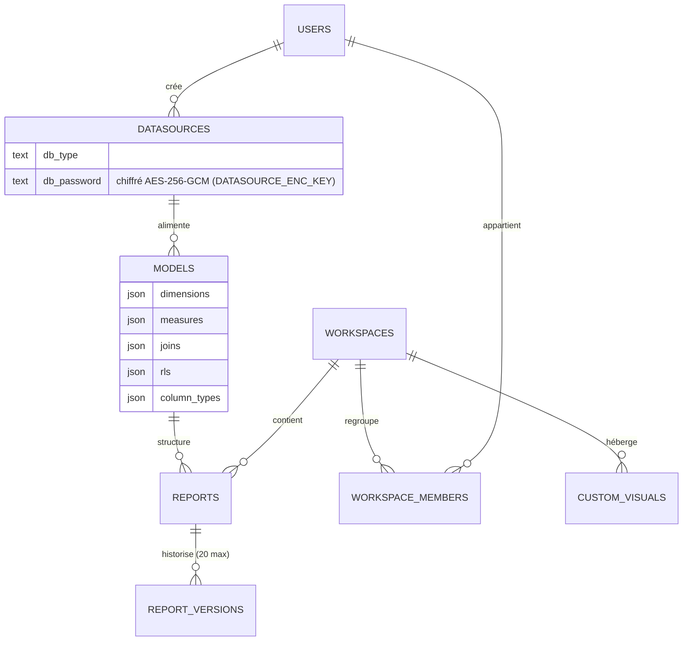
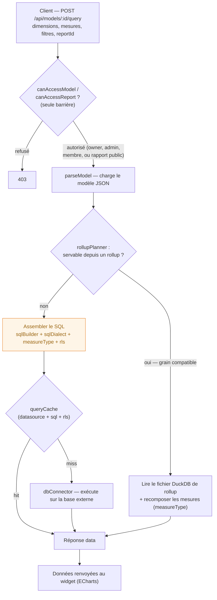
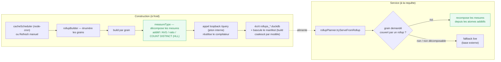
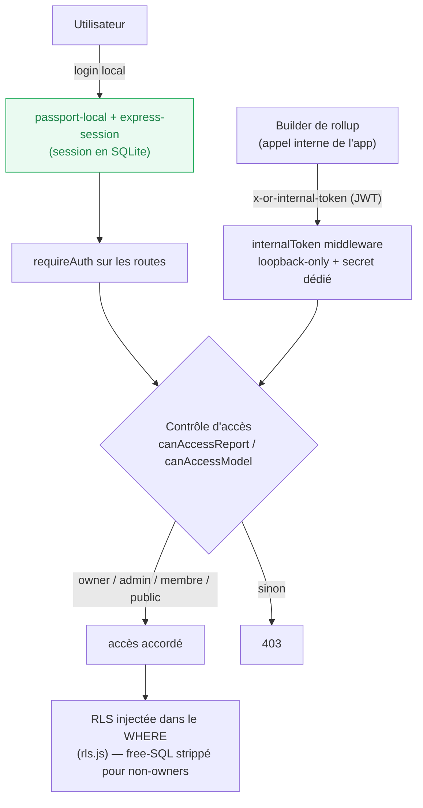

# Architecture — OpenReport

Vue d'ensemble du système, du plus large au plus fin. Doc **courte et volontairement à gros
grain** : pour le détail, elle renvoie aux sources de vérité plutôt que de les recopier.

- Stack, commandes, carte du code, surfaces sensibles, conventions → **`CLAUDE.md`** (racine).
- Spécification du cache de pré-agrégation → **`ROLLUP-CACHE.md`** (racine).
- Contrat HTTP → **[API.md](API.md)** · modèle de permissions → **[AUTHORIZATION.md](AUTHORIZATION.md)**.

Diagrammes en Mermaid (rendus sur GitHub / VS Code).

## En une phrase

OpenReport est un outil BI self-host : on connecte une base (**datasource**), on définit une couche
sémantique (**model** : dimensions, mesures, jointures, RLS), on compose des **reports** à widgets,
et l'application compile puis exécute du SQL multi-dialecte, avec un cache de pré-agrégation.

## Trois plans de données séparés

La donnée est répartie sur trois stockages aux rôles distincts — c'est un choix de design central :

| Plan | Stockage | Contenu |
|---|---|---|
| **Control plane** | SQLite (`server/data/open-report.db`, WAL) | Métadonnées de l'app : `users`, `datasources`, `models`, `reports`, `report_versions`, `workspaces`, `workspace_members`, `custom_visuals`, `cache_schedules`, `rollups` (manifest), `app_settings`, et les sessions. |
| **Cache layer** | DuckDB (`server/data/rollups_*.duckdb`) | Tables de pré-agrégation (rollups), fichiers par génération, bascule blue-green. |
| **Data plane** | Bases externes des clients | Données analytiques brutes (Postgres / MySQL / MSSQL / BigQuery / DuckDB). Interrogées en live ; **la donnée client reste chez le client**. |

Les secrets de connexion (`datasources.db_password`, credentials dans `extra_config`) sont
**chiffrés au repos en AES-256-GCM** (clé `DATASOURCE_ENC_KEY`), déchiffrés uniquement au moment de
créer la connexion.

## 1. Couches & composants

Le moteur SQL (`ENG`) concentre la complexité du produit ; c'est aussi le plus gros fichier
(`routes/models.js`, cible de découpe future — voir *God-files* dans `CLAUDE.md`).

## 2. Modèle conceptuel

La chaîne métier : **datasource** → **model** (sémantique, colonnes JSON) → **report** (layout +
widgets). Tables de la base de métadonnées.

## 3. Flux d'une requête de widget

Le chemin le plus important : `POST /api/models/:id/query`. La route est **publique par design**
(pour permettre les rapports publics) ; le contrôle d'accès `canAccessModel` / `canAccessReport`
est l'**unique barrière** avant le SQL. L'assemblage SQL reste la surface d'injection à protéger :
tout identifiant/valeur passe par `quoteIdent` / `quoteLiteral` ou est coercé en nombre, et les
expressions free-SQL *report-scoped* sont retirées pour les non-propriétaires.

> Les étapes B→R (parse, plan, build SQL, cache, exec) vivent aujourd'hui dans un seul gros
> handler. Les boîtes sont les coutures naturelles d'une découpe ultérieure sans changement de
> comportement.

## 4. Cache de pré-agrégation (rollup)

Deux temps : **construction** (à froid, planifiée ou manuelle) et **service** (à la requête). Le
builder réutilise **le même compilateur** que les requêtes via un appel `/query` en boucle locale
(cohérence cache/live garantie). Détails complets dans `ROLLUP-CACHE.md`.

## 5. Authentification & contrôle d'accès

Deux voies d'entrée : l'utilisateur (session passport, stockée en SQLite) et le **jeton interne**
que l'app se présente à elle-même pour le réchauffage du cache — désormais dérivé d'un secret
dédié obligatoire (`INTERNAL_TOKEN_SECRET`, distinct de `SESSION_SECRET`) et **restreint aux
requêtes loopback**. Le cloisonnement multi-client repose sur `canAccessReport` / `canAccessModel`,
puis la **RLS** injectée dans le `WHERE` (voir [AUTHORIZATION.md](AUTHORIZATION.md)).

**Limitations connues** (documentées, non des régressions) : la RLS est un filtre SQL appliqué au
`WHERE` du modèle — le durcissement free-SQL ferme le vecteur principal de contournement, mais ce
modèle reste applicatif (pas d'isolation au niveau base). Voir `CLAUDE.md` § « Surfaces sensibles ».

---

> Pour les emplacements précis dans le code et l'état de la dette, voir `CLAUDE.md` (carte du code,
> god-files, surfaces sensibles). Cette doc évite volontairement les numéros de ligne pour rester
> valable après refactor.
